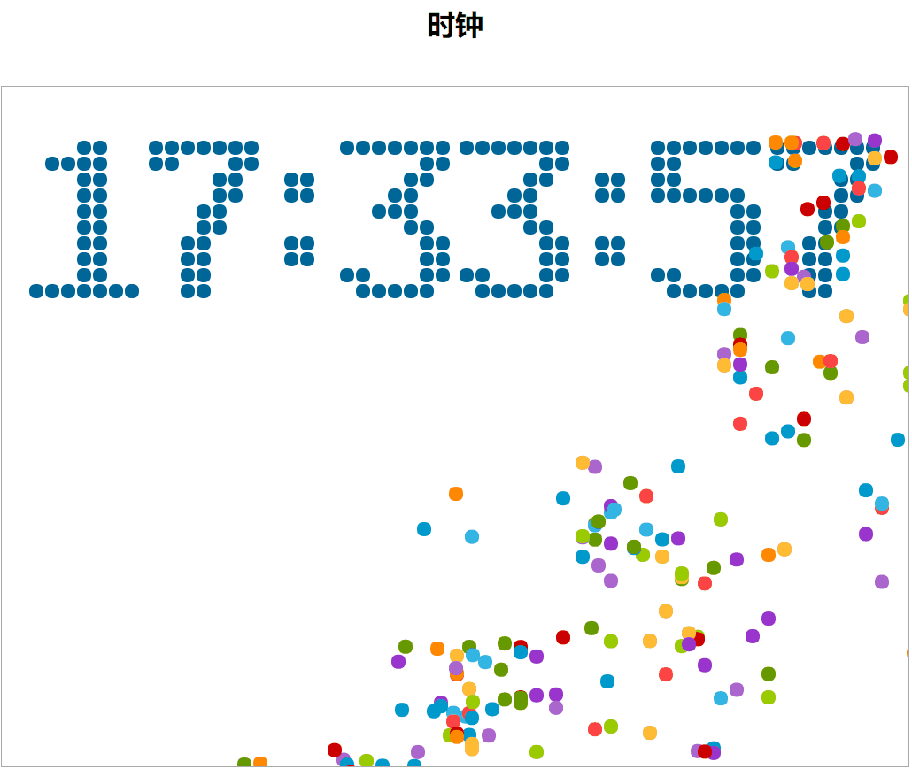

# html canvas制作的绚丽倒计时和时钟

##  项目运行截图



注：getCurrentShowTimeSeconds方法中有endTimer的是倒计时
```
function getCurrentShowTimeSeconds() {
    /**
     * 倒计时
     * @type {Date}
     */
    // var curTime = new Date();
    // var ret = endTime.getTime() - curTime.getTime();
    // ret = Math.round(Math.abs(ret) / 1000);
    // return ret >= 0 ? ret : 0;

    /**
     * 时钟
     * @type {Date}
     */
    var curTime = new Date();
    var ret = curTime.getHours() * 3600 + curTime.getMinutes() * 60 + curTime.getSeconds();
    return ret;
}
```


